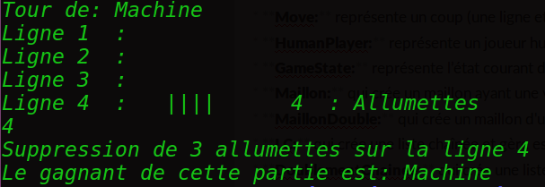
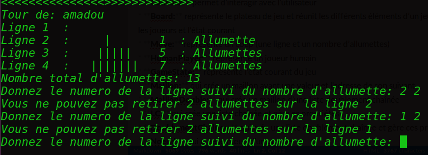
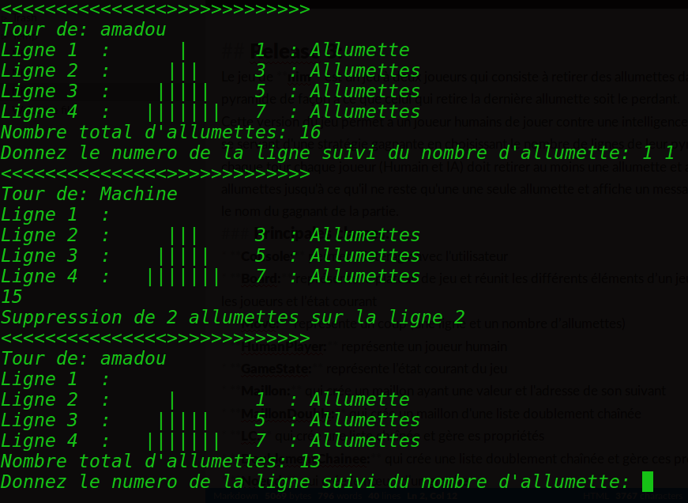


## Release 3:
Le jeu de **nim** est un jeu à deux joueurs qui consiste à retirer des allumettes dans une pyramide de façon a ce que celui qui retire la dernière allumette soit le perdant.
Cette version du jeu permet a un joueur humains de jouer contre une intelligence artificielle se servant d'une stratégie gagnante en choisissant le nombre de lignes de leur pyramide et à chaque tour chaque joueur (Humain et IA) doit retirer au moins une allumette et au plus trois allumettes jusqu'à ce qu'il ne reste qu'une une seule allumette et affiche un message donnant le nom du gagnant de la partie. 
### Principales classes:
* **Console:** permet d'interagir avec l'utilisateur
* **Board:** représente le plateau de jeu et réunit les différents éléments d’un jeu :
les joueurs et l’état courant
* **Move:** représente un coup (une ligne et un nombre d’allumettes)
* **HumanPlayer:** représente un joueur humain
* **GameState:** représente l’état courant du jeu
* **Maillon:** qui crée un maillon ayant une valeur et l'adresse de son suivant
* **MaillonDouble:** qui crée un maillon d'une liste doublement chaînée
* **LC:** qui crée une liste chaînée et gère ses propriétés
* **DoublementChainee:** qui crée une liste doublement chaînée et gère ses propriétés
* **Noeud:** qui crée le nœud d'un graphe
* **Graphes:** qui crée un graphe en servant d'une liste chaînée de nœuds et détermine le noyau du graphe
* **GameStateTest:** effectue les tests unitaires pour la classe **GameState**
* **BoardTest:** effectue les tests des méthodes de la classe **Board**
* **NoyauTest** vérifie qu’après avoir créé un graphe et avoir déterminé son noyau , tous les éléments du noyau qui sont marqués comme appartenant au noyau et aucun éléments hors du noyau n'est marqué ainsi.

### Principes du jeu:
Pour commencer une partie de nim contre une IA naïve il faut saisir le nombre de lignes de la pyramide de jeu , cette tache est effectuée par la fonction *getSize()* de la classe **Console** , elle veille à ce que le nombre saisi soit toujours supérieur à 1. **(voir image ci-dessous)**  

Après avoir saisi le nombre de lignes du plateau l'ordinateur demande à ce que le joueur humain saisisse son nom en se servant de la méthode *askName()* de la classe **Console** qui récupère une chaîne de caractère et crée un joueur humain en se servant du constructeur de la classe **HumanPlayer**. **(voir image ci-dessous)**

Une fois toutes ces informations recueillies l'ordinateur commence a faire jouer en appelant la méthode jouerTour() de la classe **Board** qui fait jouer les joueurs  jusqu'à ce qu'il ne reste qu’une seule allumette puis appelle la fonction *showWinner()* de la classe **Console** pour afficher le nom du gagnant. **(voir image ci -dessous)**

Pour chaque tour le  joueur humain joue, la pyramide du jeu s'affiche en appelant la fonction *showBoard()* de la classe **Console** et le joueur choisit la ligne sur la quelle il veut supprimer des allumettes en appelant la méthode *getMove(String)* de la classe **Console** qui retourne un **Move** dont la validité est vérifiée par appel de la méthode *validMove(Move)* de la classe **Board** qui retourne un booléen vérifiant la validité d'un coup et si cette méthode retourne vrai ce nombre d’allumettes est retiré de la ligne en utilisant la méthode *supprimer(Move)* de la classe **GameState** et c'est à l'IA de jouer en utilisant une méthode qui est expliquée ci-dessous  sinon l'ordinateur affiche un message d'erreur en utilisant la fonction *InvalidMove(Move)* de la classe **Console** tant que l'utilisateur ne fait pas un choix correct. **(Image coup invalide)**

Pour l'IA le choix du coup à jouer est effectué en appelant la méthode *selectMoveMachine(int)* de la classe **Board** qui se base sur la théorie des graphes et du noyau (Elle crée un graphe à travers le constructeur *Graphes(int)* de la classe **Graphes** qui crée une liste de **Noeud** dont le premier élément est la valeur de l'entier en paramètre et dont les valeurs représentent une situation possible de notre jeu, les différentes positions accessibles en effectuant des coups et un entier qui est à 0 si le nœud n'est pas marqué, 1 s'il est du noyau et -1 s'il n'est pas du noyau. Pour créer le noyau du graphe l'appel de la méthode *Noyau()* de la classe **Graphe** parcourt notre liste, pour un premier temps marque tous les éléments qui n'ont pas de successeurs comme éléments du noyau, ensuite marque tous les prédécesseurs ces derniers comme non éléments du noyau et ainsi de suite jusqu'à ce que tous les nœuds soient marqués) . Après avoir créé le noyau la machine joue le coup qui la place dans le noyau et si cela n'est pas possible elle joue un coup d'attente en attendant que le joueur humain fasse une erreur.**(Tour de jeu)**
 

### Documentation:
* [**javadoc**](https://openclassrooms.com/courses/presentation-de-la-javadoc)
 * [**junit**](https://openclassrooms.com/courses/les-tests-unitaires-en-java)
* [**markdown**](https://fr.wikipedia.org/wiki/Markdown)
* [**graphes**](http://www.pierreaudibert.fr/tra/Noyau%20d%27un%20graphe.pdf)
* [**Graphes_et_jeu_de_nim**](https://interstices.info/jcms/c_33343/jeux-de-nim)

